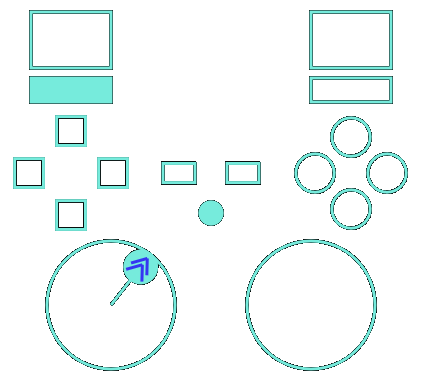

## Gamepad Viewer

This repo has the code for a simple Windows gamepad viewer program.

When sitting on a white background, it looks like this:



However, by default the UI is mostly transparent, with only the
(by default) blue-green lines visible.  It is intended to be made
topmost (with a menu option or by pressing T) and then sit on top of
a game window, so in actual use the background will be the game.


## Features

The main features are:

* Shows the state of all of the controls exposed via the
  [XInput](https://learn.microsoft.com/en-us/windows/win32/xinput/programming-guide)
  API: two directional sticks, two analog triggers, four dpad buttons,
  four round face buttons, select, start, shoulder bumpers, and
  stick-down buttons.

* Optionally shows all of the inputs in their raw numeric form, which
  can be useful for tuning dead zones.

* Transparent UI can sit on top of a game screen, showing controller
  state without obscuring too much of the view.

* Resizable.

* Configurable colors.

* Built-in top-most window functionality.

* The trigger and thumb sticks have configurable dead zones, by default
  tuned to approximately match what Elden Ring uses.

* Customizable layout, albeit by editing a JSON configuration file.  See
  the `gpv-config.h` source code for a description of the fields.

Features for Elden Ring specifically:

* Whenever L2 is pressed, the viewer briefly displays a timer, with the
  active parry frames for (by default) Carrian Retaliation indicated
  with a red color.  This is useful when reviewing recorded game footage
  to see whether a parry attempt had the right timing.

* Whenever B/Circle is released, a small dot appears inside the
  corresponding button indicator for 33ms afterwards, which ensures that
  a 30 FPS recording contains evidence of a button press, even if it is
  pressed for less than one frame and hence the recording may not show
  it filled (pressed) at any point.  (I may add that for other buttons
  too in the future.)


## Build instructions

The `Makefile` runs on
[Cygwin](https://www.cygwin.com/) and nominally invokes the
[WinLibs MinGW compiler](https://winlibs.com/).  In that configuration,
just run:

```
$ make
```

But the code is just a handful of `.cc` files linking with standard
Windows libraries so it should be easy to build with any C++ compiler.


## User interface

Run the executable and the window will pop up.

Left-click and drag any opaque part to move the window.

Right-click to open the context menu, allowing customization.  The
context menu also shows the key bindings.


## Limitations

See [todo.txt](todo.txt) for minor issues, enhancements, etc.


## Diagnostic environment variables

If `TRANSPARENT` is set to 0, the transparent window mechanism is
disabled and the solid black background normally used as the
transparency key becomes visible.

If `TRACE` is set to a number greater than 1, various tracing messages
are printed.  2 is low-volume, 3 is somewhat higher volume.  1 (the
default) prints possible some errors that aren't otherwise reported.


## License

The MIT License

Copyright 2024 Scott McPeak

Permission is hereby granted, free of charge, to any person obtaining a
copy of this software and associated documentation files (the
"Software"), to deal in the Software without restriction, including
without limitation the rights to use, copy, modify, merge, publish,
distribute, sublicense, and/or sell copies of the Software, and to
permit persons to whom the Software is furnished to do so, subject to
the following conditions:

The above copyright notice and this permission notice shall be included
in all copies or substantial portions of the Software.

THE SOFTWARE IS PROVIDED "AS IS", WITHOUT WARRANTY OF ANY KIND, EXPRESS
OR IMPLIED, INCLUDING BUT NOT LIMITED TO THE WARRANTIES OF
MERCHANTABILITY, FITNESS FOR A PARTICULAR PURPOSE AND NONINFRINGEMENT.
IN NO EVENT SHALL THE AUTHORS OR COPYRIGHT HOLDERS BE LIABLE FOR ANY
CLAIM, DAMAGES OR OTHER LIABILITY, WHETHER IN AN ACTION OF CONTRACT,
TORT OR OTHERWISE, ARISING FROM, OUT OF OR IN CONNECTION WITH THE
SOFTWARE OR THE USE OR OTHER DEALINGS IN THE SOFTWARE.
